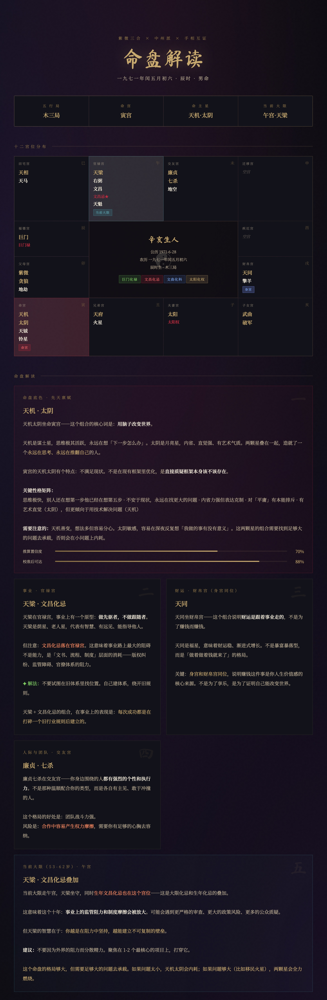

# 命理解读师 · mingli-master

[](LICENSE)
[](https://python.org)
[](https://fastapi.tiangolo.com)
[](https://developers.weixin.qq.com/miniprogram/dev/framework/)

一套「紫微斗数 + 四柱八字」命理解读系统：**Python 精确排盘 → 确定性规则引擎判格局 → 大模型（DeepSeek）生成解读 → 可视化输出**。既能作为本地 HTTP 服务 / 网页控制台使用，也配套了一个微信小程序前端。

> 命由象推，不是预言，是概率地图。本项目仅供传统文化学习与技术研究，不构成任何决策建议。

## 目录

- [项目组成](#项目组成)
- [整体架构](#整体架构)
- [效果 & 截图](#效果--截图)
- [快速开始](#快速开始)
- [微信小程序](#微信小程序)
- [环境变量与密钥](#环境变量与密钥)
- [仓库结构](#仓库结构)
- [安全说明（上传 GitHub 前必读）](#安全说明上传-github-前必读)
- [致谢与许可证](#致谢与许可证)

## 项目组成

这个仓库其实包含了几个可以独立看待的子项目，它们围绕同一套排盘/解读能力：

| 子项目 | 目录 / 文件 | 作用 |
|--------|-------------|------|
| **HTTP 服务** | [`mingli_server.py`](mingli_server.py) | FastAPI 服务，串起「排盘 → 出题校准 → 手相互证 → 大模型解读 → HTML 命盘」的多步骤流程，用 MySQL 存会话；并对外提供小程序专用接口 |
| **命令行一键接口** | [`mingli_api.py`](mingli_api.py) | 不依赖数据库，一条命令把「排盘 → DeepSeek 解读 → HTML」跑完，适合脚本化调用 |
| **紫微斗数排盘引擎** | [`scripts/`](scripts) | `calculate_chart.py` 排盘、`gezhi_rules.py` 格局判定与量化、`generate_html.py` 生成命盘、`calibration.py` 校准题库 |
| **四柱八字引擎** | [`bazi/`](bazi) | `pai_pan.py` 四柱/大运/流年/神煞排盘，`references/` 是经典典籍规则参考 |
| **网页控制台** | [`web/index.html`](web/index.html) | 单文件网页，把上面各接口串成可视化调用面板 |
| **微信小程序** | [`miniprogram/`](miniprogram) | 「趣说干支」小程序前端：干支历法、生肖属相、名字灵感等页面 |
| **Agent Skill** | [`SKILL.md`](SKILL.md)、[`bazi/SKILL.md`](bazi/SKILL.md) | 可被 Claude Code / Cursor 等 AI agent 加载的 Skill 定义 |
| **接口文档** | [`API.md`](API.md) | 全部 HTTP 接口的详细说明与示例 |

两套命理体系：

- **紫微斗数**：安命宫、定五行局、安十四主星、四化飞星，判杀破狼/紫府武相/机月同梁等格局，扫描流年/大限/生年化忌的时空压力，可选手相互证。
- **四柱八字**：排四柱、大运、流年、神煞，参照《穷通宝典》《三命通会》《滴天髓》《渊海子平》《子平真诠》等经典做日主强弱、五行喜忌、十神、格局分析。

排盘全部用 Python 精确计算（紫微用 [iztro-py](https://github.com/spyfree/iztro-py)），**不让大模型算数学**；格局判定也是确定性规则引擎，大模型只负责把星曜语言翻译成人话。

## 整体架构

```
                      ┌─────────────────────────┐
   微信小程序 ───────▶│                         │
   (miniprogram/)     │   FastAPI 服务          │
                      │   mingli_server.py      │──▶ MySQL (会话/历史)
   网页控制台 ───────▶│                         │
   (web/index.html)   │  ┌───────────────────┐  │──▶ output/ (命盘 HTML)
                      │  │ 紫微: scripts/    │  │
   命令行 ───────────▶│  │ 八字: bazi/       │  │──▶ uploads/ (手相照片)
   (mingli_api.py)    │  └───────────────────┘  │
                      └───────────┬─────────────┘
                                  │
                    ┌─────────────┴──────────────┐
                    ▼                             ▼
              DeepSeek API                 通义千问 qwen-vl
             (文本解读)                    (手相照片识别，可选)
```

## 效果 & 截图

### 命盘 HTML 报告

紫微斗数命盘示例（马斯克命盘，典藏主题）：



每张命盘都包含：宏观格局仪表盘（格局判定 + 三维量化进度条）、命盘底色、事业财运、感情婚姻、当前大限、时空压力热力表，以及可选的手相互证。页面右上角可一键切换「典藏（金黑古典）/ 赛博（发光卡片）」双主题。

### 微信小程序页面

> 下面是占位图。请用微信开发者工具模拟器截图后，把图片放到 [`assets/screenshots/`](assets/screenshots)（文件名见该目录下的说明），GitHub 上就会自动显示。

| 启动页 | 干支历法 | 生肖属相 |
|:------:|:--------:|:--------:|
|  |  |  |

## 快速开始

### 前置依赖

```bash
pip install iztro-py fastapi "uvicorn[standard]" pymysql python-multipart
```

紫微排盘用 [iztro-py](https://github.com/spyfree/iztro-py)（≥ 0.5.0）。服务端会话存储需要一个 MySQL 实例，建一个库（默认名 `mingli`）即可，表结构由服务启动时自动创建。

### 方式一：命令行一键出命盘（最简单）

不需要数据库，一条命令跑完排盘 + 解读 + HTML：

```bash
export DEEPSEEK_API_KEY=sk-你的DeepSeek密钥
python mingli_api.py --solar 1991-8-15 --hour 1 --gender 男 --outdir ./output
```

也可以不带参数直接 `python mingli_api.py` 进入交互式问答。

### 方式二：启动 HTTP 服务 + 网页控制台

```bash
# 配置密钥（Windows PowerShell 用 $env:NAME = "..."）
export DEEPSEEK_API_KEY=sk-你的DeepSeek密钥
export DB_PASSWORD=你的MySQL密码

# 启动（端口被占用可改 --port 8010）
python -m uvicorn mingli_server:app --host 127.0.0.1 --port 8000
```

启动后：

- 网页控制台：<http://127.0.0.1:8000/>
- 在线接口文档（Swagger）：<http://127.0.0.1:8000/docs>
- 完整接口说明见 [API.md](API.md)

最快上手（curl）：

```bash
# ① 排盘，记住返回的 id
curl -X POST http://127.0.0.1:8000/api/chart -H "Content-Type: application/json" \
  -d '{"calendar":"solar","date":"1991-8-15","hour":1,"gender":"男","year":2026}'

# ② 大模型解读（假设上一步返回 id=5）
curl -X POST http://127.0.0.1:8000/api/5/interpret

# ③ 浏览器打开命盘 HTML
open http://127.0.0.1:8000/api/5/html
```

八字接口同理，把路径换成 `/api/bazi/chart`、`/api/bazi/{id}/interpret`。

## 微信小程序

小程序「趣说干支」在 [`miniprogram/`](miniprogram)，页面包括：

- **启动页**：两个入口（干支历法、生肖属相）
- **干支历法页**：输入公历/农历日期与时辰，展示对应年/月/日/时干支
- **生肖属相页**：输入公历年份，前端本地换算干支纪年与生肖
- **名字灵感页**：按姓氏和风格偏好给出汉字寓意、读音参考

运行步骤：

1. 先按上面「方式二」启动后端 `mingli_server.py`。
2. 用微信开发者工具打开 [`miniprogram/`](miniprogram) 目录。
3. 本地调试可在开发者工具里关闭域名校验。
4. 真机 / 上线前，把 [`miniprogram/app.js`](miniprogram/app.js) 里的 `apiBase` 改成你**已备案**且在微信公众平台配置为 request 合法域名的 HTTPS 后端；在 [`miniprogram/project.config.json`](miniprogram/project.config.json) 填入你自己的小程序 `appid`。

小程序启动时调用 `wx.login()` → `POST /api/miniapp/login`，后端用 `openid` 派生 `user_key`，后续请求自动带 `X-Mingli-User` 头。小程序接口不暴露数据库自增编号，只用随机 `token`；服务端算力有限，默认限制同一用户每天生成 1 次新解读（重复查看旧解读不计次）。

> ⚠️ [`miniprogram/`](miniprogram) 目录里带有一个独立的 `.git`（嵌套仓库）。如果你要把整个项目作为一个仓库上传，建议先删掉 `miniprogram/.git`，否则 Git 会把它当成 submodule 而不追踪里面的文件。

小程序更详细的说明见 [miniprogram/README.md](miniprogram/README.md)。

## 环境变量与密钥

所有密钥都通过**环境变量**注入，仓库里不含任何真实密钥。

| 变量 | 默认值 | 说明 |
|------|--------|------|
| `DEEPSEEK_API_KEY` | 空 | DeepSeek 密钥（文本解读，必填） |
| `DEEPSEEK_MODEL` | `deepseek-v4-pro` | 可选 `deepseek-v4-flash` |
| `DASHSCOPE_API_KEY` | 空 | 通义千问 qwen-vl 密钥（手相照片识别，可选） |
| `QWEN_VL_MODEL` | `qwen-vl-max` | 视觉模型 |
| `DB_HOST` / `DB_PORT` | `127.0.0.1` / `3306` | MySQL 地址 |
| `DB_USER` / `DB_PASSWORD` | `root` / 空 | MySQL 账号（**务必用环境变量配置密码**） |
| `DB_NAME` | `mingli` | 数据库名 |
| `WECHAT_APPID` / `WECHAT_SECRET` | 空 | 小程序 AppID / AppSecret（换取 openid 用） |
| `USER_KEY_SALT` | — | openid 派生 user_key 的盐，可自定义 |
| `MINIAPP_DAILY_INTERPRET_LIMIT` | `1` | 小程序用户每日解读次数 |
| `REQUIRE_HTTPS` | — | 设为 `1` 后小程序接口拒绝 HTTP |

## 仓库结构

```
mingli-master/
├── mingli_server.py          # FastAPI 服务（紫微 + 八字 + 小程序接口）
├── mingli_api.py             # 命令行一键接口（排盘→DeepSeek→HTML）
├── API.md                    # HTTP 接口详细文档
├── SKILL.md                  # 紫微斗数 Agent Skill 定义
├── scripts/                  # 紫微斗数引擎
│   ├── calculate_chart.py    #   排盘（iztro-py + 后处理）
│   ├── gezhi_rules.py        #   格局判定与量化规则引擎
│   ├── generate_html.py      #   命盘 HTML 生成
│   └── calibration.py        #   校准问题库
├── bazi/                     # 四柱八字引擎
│   ├── pai_pan.py            #   四柱/大运/流年/神煞排盘
│   ├── SKILL.md              #   八字 Agent Skill 定义
│   └── references/           #   经典典籍规则参考
├── templates/
│   └── chart_template.html   # 命盘 HTML 模板（典藏 + 赛博双主题）
├── web/
│   └── index.html            # 网页控制台（可视化调用面板）
├── miniprogram/              # 微信小程序「趣说干支」
│   ├── app.js / app.json     #   入口与全局配置（apiBase 在此）
│   └── pages/                #   launch / bazi / chart / names 页面
├── assets/
│   ├── musk-mingpan.jpg      #   示例命盘截图
│   └── screenshots/          #   小程序截图（放你自己的图）
└── uploads/                  # 手相照片上传目录（运行时生成）
```

## 安全说明（上传 GitHub 前必读）

本次整理已经把仓库里的真实密钥/凭据全部移除或改为占位符：

- ✅ `mingli_server.py`：内置的 DashScope（通义千问）密钥、MySQL 默认密码已清空，改为从环境变量读取。
- ✅ `miniprogram/app.js` + `miniprogram/README.md`：真实后端域名改为 `your-backend-domain.com` 占位。
- ✅ `miniprogram/project.config.json`：真实小程序 `appid` 改为 `your-wechat-appid` 占位。
- ✅ `API.md`：文档里的默认密码 / 「已内置密钥」表述已更正。

上传前再自查一遍：

- **不要**把真实的 `DEEPSEEK_API_KEY` / `DASHSCOPE_API_KEY` / `WECHAT_SECRET` / 数据库密码写进任何文件，一律走环境变量。
- 删除 `miniprogram/.git` 嵌套仓库（见上文），并确认 `uploads/`、`output/` 等运行时目录不含隐私照片或命盘。
- 建议再跑一次全局搜索确认：搜 `sk-`、`password`、`secret`、`appid` 等关键词。

> 前端（小程序 / 网页）永远不要放任何服务端密钥；DeepSeek、微信 AppSecret 等只应存在于后端环境变量中。

## 致谢与许可证

- [iztro](https://github.com/SylarLong/iztro) — 紫微斗数排盘 JavaScript 库
- [iztro-py](https://github.com/spyfree/iztro-py) — 纯 Python iztro 实现
- 八字部分参照《穷通宝典》《三命通会》《滴天髓》《渊海子平》《子平真诠》等经典典籍

许可证：[MIT](LICENSE)。

> *「算命是对话，不是表演。准确度随沟通趋近。」本项目仅供学习与技术研究，内容不构成任何医疗、法律、投资或人生决策建议。*
